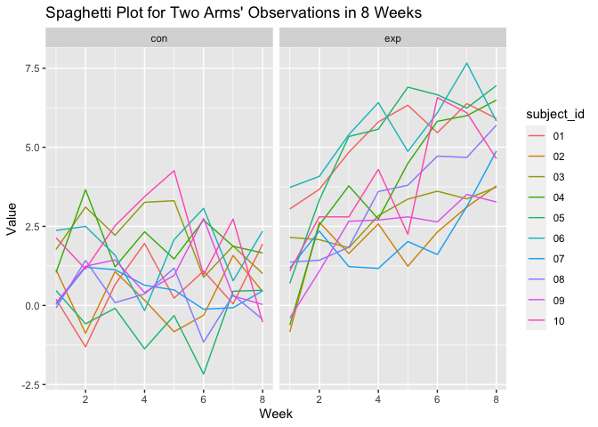

Homework 5
================
Yujin Zhang

``` r
library(tidyverse)
```

    ## ── Attaching packages ─────────────────────────────────────── tidyverse 1.3.1 ──

    ## ✓ ggplot2 3.3.5     ✓ purrr   0.3.4
    ## ✓ tibble  3.1.5     ✓ dplyr   1.0.7
    ## ✓ tidyr   1.1.3     ✓ stringr 1.4.0
    ## ✓ readr   2.0.1     ✓ forcats 0.5.1

    ## ── Conflicts ────────────────────────────────────────── tidyverse_conflicts() ──
    ## x dplyr::filter() masks stats::filter()
    ## x dplyr::lag()    masks stats::lag()

``` r
library(ggplot2)
```

## Problem 1

Describe the raw data. Create a city\_state variable (e.g. “Baltimore,
MD”) and then summarize within cities to obtain the total number of
homicides and the number of unsolved homicides (those for which the
disposition is “Closed without arrest” or “Open/No arrest”).

``` r
homicide_df = 
  read_csv("./data/homicide-data.csv", na = c("", "Unknown")) %>% 
  janitor::clean_names() %>% 
  mutate(
    city_state = str_c(city, state),
    resolution = case_when(
      disposition == "Closed without arrest" ~ "unsolved",
      disposition == "Open/No arrest" ~ "unsolved",
      disposition == "Closed by arrest" ~ "solved",
    )
         ) %>% 
  relocate(city_state) %>% 
  filter(city_state != "TulsaAL")
```

    ## Rows: 52179 Columns: 12

    ## ── Column specification ────────────────────────────────────────────────────────
    ## Delimiter: ","
    ## chr (8): uid, victim_last, victim_first, victim_race, victim_sex, city, stat...
    ## dbl (4): reported_date, victim_age, lat, lon

    ## 
    ## ℹ Use `spec()` to retrieve the full column specification for this data.
    ## ℹ Specify the column types or set `show_col_types = FALSE` to quiet this message.

For the city of Baltimore, MD, use the prop.test function to estimate
the proportion of homicides that are unsolved; save the output of
prop.test as an R object, apply the broom::tidy to this object and pull
the estimated proportion and confidence intervals from the resulting
tidy dataframe.

``` r
baltimore_df =
  homicide_df %>% 
  filter(city_state == "BaltimoreMD")

baltimore_summary =
  baltimore_df %>% 
  summarize(
    unsolved = sum(resolution == "unsolved"),
    n = n()
  )

# make prop.test
baltimore_test =
  prop.test(
  x = baltimore_summary %>% pull(unsolved),
  n = baltimore_summary %>% pull(n)
  )

# organize the data frame
baltimore_test %>% 
  broom::tidy()
```

    ## # A tibble: 1 × 8
    ##   estimate statistic  p.value parameter conf.low conf.high method    alternative
    ##      <dbl>     <dbl>    <dbl>     <int>    <dbl>     <dbl> <chr>     <chr>      
    ## 1    0.646      239. 6.46e-54         1    0.628     0.663 1-sample… two.sided

Now run prop.test for each of the cities in your dataset, and extract
both the proportion of unsolved homicides and the confidence interval
for each. Do this within a “tidy” pipeline, making use of purrr::map,
purrr::map2, list columns and unnest as necessary to create a tidy
dataframe with estimated proportions and CIs for each city.

``` r
# create function for prop.test
prop_test_function = function(city_df) {
  
  city_summary =
    city_df %>% 
    summarize(
      unsolved = sum(resolution == "unsolved"),
      n = n()
  )

  # make prop.test
  city_test =
    prop.test(
      x = city_summary %>% pull(unsolved),
      n = city_summary %>% pull(n)
    )

  return(city_test)
  
}

homicide_df %>% 
  filter(
    city_state == "BaltimoreMD"
  ) %>% 
  prop_test_function()
```

    ## 
    ##  1-sample proportions test with continuity correction
    ## 
    ## data:  city_summary %>% pull(unsolved) out of city_summary %>% pull(n), null probability 0.5
    ## X-squared = 239.01, df = 1, p-value < 2.2e-16
    ## alternative hypothesis: true p is not equal to 0.5
    ## 95 percent confidence interval:
    ##  0.6275625 0.6631599
    ## sample estimates:
    ##         p 
    ## 0.6455607

Then run prop.test for each of the cities in dataset.

``` r
nested_df = 
  homicide_df %>% 
  nest(data = uid:resolution) %>% 
  mutate(
    test_result = map(data, prop_test_function),
    tidy_result = map(test_result, broom::tidy)
    ) %>% 
  select(city_state, tidy_result) %>% 
  unnest(tidy_result) %>% # unnest the data frame
  select(city_state, estimate, starts_with("conf"))
```

Create a plot that shows the estimates and CIs for each city – check out
geom\_errorbar for a way to add error bars based on the upper and lower
limits. Organize cities according to the proportion of unsolved
homicides.

``` r
# make errorbar plot
nested_df %>% 
  mutate(city_state = fct_reorder(city_state, estimate)) %>% 
  ggplot(aes(x = city_state,y = estimate)) +
  geom_point() +
  geom_errorbar(aes(ymin = conf.low, ymax = conf.high)) +
  theme(axis.text.x = element_text(angle = 90, vjust = 0.5, hjust = 1))
```

<!-- -->

## Problem 2

Create a tidy dataframe containing data from all participants, including
the subject ID, arm, and observations over time:

Start with a dataframe containing all file names.Iterate over file names
and read in data for each subject using purrr::map and saving the result
as a new variable in the dataframe.

Tidy the result; manipulate file names to include control arm and
subject ID, make sure weekly observations are “tidy”, and do any other
tidying that’s necessary.

``` r
# make function to read data in files
read_data_function = function(file_df) {
  
  patient_df = 
    read_csv(file_df)
  
  return(patient_df)
}

# create a data frame containing all participants
longitudinal_df =
  tibble(
    files = list.files("./data/p2data")
  ) %>% 
  mutate(
    path = map(.x = files, ~paste("./data/p2data", ., sep = "/"))
  ) %>%                                                             # add path
  mutate(files = str_extract(files, "[conexp]{3}_[0-9]{2}")) %>%    # delete ".csv"
  separate(
    files, into = c("arm", "subject_id", sep = "_")) %>%            # add participants variable
  mutate(
    observations = map(path, read_data_function)) %>% 
  select(-"_")
```

    ## Warning: Expected 3 pieces. Missing pieces filled with `NA` in 20 rows [1, 2, 3,
    ## 4, 5, 6, 7, 8, 9, 10, 11, 12, 13, 14, 15, 16, 17, 18, 19, 20].

    ## Rows: 1 Columns: 8

    ## ── Column specification ────────────────────────────────────────────────────────
    ## Delimiter: ","
    ## dbl (8): week_1, week_2, week_3, week_4, week_5, week_6, week_7, week_8

    ## 
    ## ℹ Use `spec()` to retrieve the full column specification for this data.
    ## ℹ Specify the column types or set `show_col_types = FALSE` to quiet this message.

    ## Rows: 1 Columns: 8

    ## ── Column specification ────────────────────────────────────────────────────────
    ## Delimiter: ","
    ## dbl (8): week_1, week_2, week_3, week_4, week_5, week_6, week_7, week_8

    ## 
    ## ℹ Use `spec()` to retrieve the full column specification for this data.
    ## ℹ Specify the column types or set `show_col_types = FALSE` to quiet this message.

    ## Rows: 1 Columns: 8

    ## ── Column specification ────────────────────────────────────────────────────────
    ## Delimiter: ","
    ## dbl (8): week_1, week_2, week_3, week_4, week_5, week_6, week_7, week_8

    ## 
    ## ℹ Use `spec()` to retrieve the full column specification for this data.
    ## ℹ Specify the column types or set `show_col_types = FALSE` to quiet this message.

    ## Rows: 1 Columns: 8

    ## ── Column specification ────────────────────────────────────────────────────────
    ## Delimiter: ","
    ## dbl (8): week_1, week_2, week_3, week_4, week_5, week_6, week_7, week_8

    ## 
    ## ℹ Use `spec()` to retrieve the full column specification for this data.
    ## ℹ Specify the column types or set `show_col_types = FALSE` to quiet this message.

    ## Rows: 1 Columns: 8

    ## ── Column specification ────────────────────────────────────────────────────────
    ## Delimiter: ","
    ## dbl (8): week_1, week_2, week_3, week_4, week_5, week_6, week_7, week_8

    ## 
    ## ℹ Use `spec()` to retrieve the full column specification for this data.
    ## ℹ Specify the column types or set `show_col_types = FALSE` to quiet this message.

    ## Rows: 1 Columns: 8

    ## ── Column specification ────────────────────────────────────────────────────────
    ## Delimiter: ","
    ## dbl (8): week_1, week_2, week_3, week_4, week_5, week_6, week_7, week_8

    ## 
    ## ℹ Use `spec()` to retrieve the full column specification for this data.
    ## ℹ Specify the column types or set `show_col_types = FALSE` to quiet this message.

    ## Rows: 1 Columns: 8

    ## ── Column specification ────────────────────────────────────────────────────────
    ## Delimiter: ","
    ## dbl (8): week_1, week_2, week_3, week_4, week_5, week_6, week_7, week_8

    ## 
    ## ℹ Use `spec()` to retrieve the full column specification for this data.
    ## ℹ Specify the column types or set `show_col_types = FALSE` to quiet this message.

    ## Rows: 1 Columns: 8

    ## ── Column specification ────────────────────────────────────────────────────────
    ## Delimiter: ","
    ## dbl (8): week_1, week_2, week_3, week_4, week_5, week_6, week_7, week_8

    ## 
    ## ℹ Use `spec()` to retrieve the full column specification for this data.
    ## ℹ Specify the column types or set `show_col_types = FALSE` to quiet this message.

    ## Rows: 1 Columns: 8

    ## ── Column specification ────────────────────────────────────────────────────────
    ## Delimiter: ","
    ## dbl (8): week_1, week_2, week_3, week_4, week_5, week_6, week_7, week_8

    ## 
    ## ℹ Use `spec()` to retrieve the full column specification for this data.
    ## ℹ Specify the column types or set `show_col_types = FALSE` to quiet this message.

    ## Rows: 1 Columns: 8

    ## ── Column specification ────────────────────────────────────────────────────────
    ## Delimiter: ","
    ## dbl (8): week_1, week_2, week_3, week_4, week_5, week_6, week_7, week_8

    ## 
    ## ℹ Use `spec()` to retrieve the full column specification for this data.
    ## ℹ Specify the column types or set `show_col_types = FALSE` to quiet this message.

    ## Rows: 1 Columns: 8

    ## ── Column specification ────────────────────────────────────────────────────────
    ## Delimiter: ","
    ## dbl (8): week_1, week_2, week_3, week_4, week_5, week_6, week_7, week_8

    ## 
    ## ℹ Use `spec()` to retrieve the full column specification for this data.
    ## ℹ Specify the column types or set `show_col_types = FALSE` to quiet this message.

    ## Rows: 1 Columns: 8

    ## ── Column specification ────────────────────────────────────────────────────────
    ## Delimiter: ","
    ## dbl (8): week_1, week_2, week_3, week_4, week_5, week_6, week_7, week_8

    ## 
    ## ℹ Use `spec()` to retrieve the full column specification for this data.
    ## ℹ Specify the column types or set `show_col_types = FALSE` to quiet this message.

    ## Rows: 1 Columns: 8

    ## ── Column specification ────────────────────────────────────────────────────────
    ## Delimiter: ","
    ## dbl (8): week_1, week_2, week_3, week_4, week_5, week_6, week_7, week_8

    ## 
    ## ℹ Use `spec()` to retrieve the full column specification for this data.
    ## ℹ Specify the column types or set `show_col_types = FALSE` to quiet this message.

    ## Rows: 1 Columns: 8

    ## ── Column specification ────────────────────────────────────────────────────────
    ## Delimiter: ","
    ## dbl (8): week_1, week_2, week_3, week_4, week_5, week_6, week_7, week_8

    ## 
    ## ℹ Use `spec()` to retrieve the full column specification for this data.
    ## ℹ Specify the column types or set `show_col_types = FALSE` to quiet this message.

    ## Rows: 1 Columns: 8

    ## ── Column specification ────────────────────────────────────────────────────────
    ## Delimiter: ","
    ## dbl (8): week_1, week_2, week_3, week_4, week_5, week_6, week_7, week_8

    ## 
    ## ℹ Use `spec()` to retrieve the full column specification for this data.
    ## ℹ Specify the column types or set `show_col_types = FALSE` to quiet this message.

    ## Rows: 1 Columns: 8

    ## ── Column specification ────────────────────────────────────────────────────────
    ## Delimiter: ","
    ## dbl (8): week_1, week_2, week_3, week_4, week_5, week_6, week_7, week_8

    ## 
    ## ℹ Use `spec()` to retrieve the full column specification for this data.
    ## ℹ Specify the column types or set `show_col_types = FALSE` to quiet this message.

    ## Rows: 1 Columns: 8

    ## ── Column specification ────────────────────────────────────────────────────────
    ## Delimiter: ","
    ## dbl (8): week_1, week_2, week_3, week_4, week_5, week_6, week_7, week_8

    ## 
    ## ℹ Use `spec()` to retrieve the full column specification for this data.
    ## ℹ Specify the column types or set `show_col_types = FALSE` to quiet this message.

    ## Rows: 1 Columns: 8

    ## ── Column specification ────────────────────────────────────────────────────────
    ## Delimiter: ","
    ## dbl (8): week_1, week_2, week_3, week_4, week_5, week_6, week_7, week_8

    ## 
    ## ℹ Use `spec()` to retrieve the full column specification for this data.
    ## ℹ Specify the column types or set `show_col_types = FALSE` to quiet this message.

    ## Rows: 1 Columns: 8

    ## ── Column specification ────────────────────────────────────────────────────────
    ## Delimiter: ","
    ## dbl (8): week_1, week_2, week_3, week_4, week_5, week_6, week_7, week_8

    ## 
    ## ℹ Use `spec()` to retrieve the full column specification for this data.
    ## ℹ Specify the column types or set `show_col_types = FALSE` to quiet this message.

    ## Rows: 1 Columns: 8

    ## ── Column specification ────────────────────────────────────────────────────────
    ## Delimiter: ","
    ## dbl (8): week_1, week_2, week_3, week_4, week_5, week_6, week_7, week_8

    ## 
    ## ℹ Use `spec()` to retrieve the full column specification for this data.
    ## ℹ Specify the column types or set `show_col_types = FALSE` to quiet this message.

``` r
# show data frame
longitudinal_df
```

    ## # A tibble: 20 × 4
    ##    arm   subject_id path      observations         
    ##    <chr> <chr>      <list>    <list>               
    ##  1 con   01         <chr [1]> <spec_tbl_df [1 × 8]>
    ##  2 con   02         <chr [1]> <spec_tbl_df [1 × 8]>
    ##  3 con   03         <chr [1]> <spec_tbl_df [1 × 8]>
    ##  4 con   04         <chr [1]> <spec_tbl_df [1 × 8]>
    ##  5 con   05         <chr [1]> <spec_tbl_df [1 × 8]>
    ##  6 con   06         <chr [1]> <spec_tbl_df [1 × 8]>
    ##  7 con   07         <chr [1]> <spec_tbl_df [1 × 8]>
    ##  8 con   08         <chr [1]> <spec_tbl_df [1 × 8]>
    ##  9 con   09         <chr [1]> <spec_tbl_df [1 × 8]>
    ## 10 con   10         <chr [1]> <spec_tbl_df [1 × 8]>
    ## 11 exp   01         <chr [1]> <spec_tbl_df [1 × 8]>
    ## 12 exp   02         <chr [1]> <spec_tbl_df [1 × 8]>
    ## 13 exp   03         <chr [1]> <spec_tbl_df [1 × 8]>
    ## 14 exp   04         <chr [1]> <spec_tbl_df [1 × 8]>
    ## 15 exp   05         <chr [1]> <spec_tbl_df [1 × 8]>
    ## 16 exp   06         <chr [1]> <spec_tbl_df [1 × 8]>
    ## 17 exp   07         <chr [1]> <spec_tbl_df [1 × 8]>
    ## 18 exp   08         <chr [1]> <spec_tbl_df [1 × 8]>
    ## 19 exp   09         <chr [1]> <spec_tbl_df [1 × 8]>
    ## 20 exp   10         <chr [1]> <spec_tbl_df [1 × 8]>

Then I tidy the results.

``` r
#unnest the list variable
unnest_df =
  longitudinal_df %>% 
  unnest(cols = "observations") %>% 
  select(-path)

# show table
knitr::kable(unnest_df)
```

| arm | subject\_id | week\_1 | week\_2 | week\_3 | week\_4 | week\_5 | week\_6 | week\_7 | week\_8 |
|:----|:------------|--------:|--------:|--------:|--------:|--------:|--------:|--------:|--------:|
| con | 01          |    0.20 |   -1.31 |    0.66 |    1.96 |    0.23 |    1.09 |    0.05 |    1.94 |
| con | 02          |    1.13 |   -0.88 |    1.07 |    0.17 |   -0.83 |   -0.31 |    1.58 |    0.44 |
| con | 03          |    1.77 |    3.11 |    2.22 |    3.26 |    3.31 |    0.89 |    1.88 |    1.01 |
| con | 04          |    1.04 |    3.66 |    1.22 |    2.33 |    1.47 |    2.70 |    1.87 |    1.66 |
| con | 05          |    0.47 |   -0.58 |   -0.09 |   -1.37 |   -0.32 |   -2.17 |    0.45 |    0.48 |
| con | 06          |    2.37 |    2.50 |    1.59 |   -0.16 |    2.08 |    3.07 |    0.78 |    2.35 |
| con | 07          |    0.03 |    1.21 |    1.13 |    0.64 |    0.49 |   -0.12 |   -0.07 |    0.46 |
| con | 08          |   -0.08 |    1.42 |    0.09 |    0.36 |    1.18 |   -1.16 |    0.33 |   -0.44 |
| con | 09          |    0.08 |    1.24 |    1.44 |    0.41 |    0.95 |    2.75 |    0.30 |    0.03 |
| con | 10          |    2.14 |    1.15 |    2.52 |    3.44 |    4.26 |    0.97 |    2.73 |   -0.53 |
| exp | 01          |    3.05 |    3.67 |    4.84 |    5.80 |    6.33 |    5.46 |    6.38 |    5.91 |
| exp | 02          |   -0.84 |    2.63 |    1.64 |    2.58 |    1.24 |    2.32 |    3.11 |    3.78 |
| exp | 03          |    2.15 |    2.08 |    1.82 |    2.84 |    3.36 |    3.61 |    3.37 |    3.74 |
| exp | 04          |   -0.62 |    2.54 |    3.78 |    2.73 |    4.49 |    5.82 |    6.00 |    6.49 |
| exp | 05          |    0.70 |    3.33 |    5.34 |    5.57 |    6.90 |    6.66 |    6.24 |    6.95 |
| exp | 06          |    3.73 |    4.08 |    5.40 |    6.41 |    4.87 |    6.09 |    7.66 |    5.83 |
| exp | 07          |    1.18 |    2.35 |    1.23 |    1.17 |    2.02 |    1.61 |    3.13 |    4.88 |
| exp | 08          |    1.37 |    1.43 |    1.84 |    3.60 |    3.80 |    4.72 |    4.68 |    5.70 |
| exp | 09          |   -0.40 |    1.08 |    2.66 |    2.70 |    2.80 |    2.64 |    3.51 |    3.27 |
| exp | 10          |    1.09 |    2.80 |    2.80 |    4.30 |    2.25 |    6.57 |    6.09 |    4.64 |

Make a spaghetti plot showing observations on each subject over time,
and comment on differences between groups.

``` r
plot_df =
  unnest_df %>% 
  pivot_longer(
    week_1:week_8,
    names_to = "week",
    names_prefix = "week_",
    values_to = "obs_value"
  ) 

# make spaghetti plot
plot_df %>% 
  group_by(arm) %>% 
  ggplot(aes(x = as.numeric(week), y  = obs_value, color = subject_id)) +
  geom_line() +
  facet_grid(.~arm) +
  labs(
    title = "Spaghetti Plot for Arms in 8 Weeks",
    x = "Week",
    y = "Value",
    ) 
```

<!-- -->

## Problem 3

Write a function that takes a vector as an argument; replaces missing
values using the rules defined; and returns the resulting vector. Apply
this function to the columns of iris\_with\_missing using a map
statement.

There are two cases to address:

For numeric variables, fill in missing values with the mean of
non-missing values. For character variables, fill in missing values with
“virginica”.

``` r
set.seed(10)

iris_with_missing = iris %>% 
  map_df(~replace(.x, sample(1:150, 20), NA)) %>%
  mutate(Species = as.character(Species))
```

Create missing data function

``` r
fill_in_missing = function(vector) {
  
  if (is.numeric(vector)) {
    
    vector =
      vector %>% 
      replace_na(mean(vector[!is.na(vector)]))
    
  }
  
  if (is.character(vector)) {
   
    vector = 
      vector %>% 
      replace_na("virginica")
    
  }
  
  return(vector)
}
```

Mapping the missing data

``` r
iris_without_missing =
  map_df(.x = iris_with_missing, ~ fill_in_missing(.x))

iris_without_missing
```

    ## # A tibble: 150 × 5
    ##    Sepal.Length Sepal.Width Petal.Length Petal.Width Species
    ##           <dbl>       <dbl>        <dbl>       <dbl> <chr>  
    ##  1         5.1          3.5         1.4         0.2  setosa 
    ##  2         4.9          3           1.4         0.2  setosa 
    ##  3         4.7          3.2         1.3         0.2  setosa 
    ##  4         4.6          3.1         1.5         1.19 setosa 
    ##  5         5            3.6         1.4         0.2  setosa 
    ##  6         5.4          3.9         1.7         0.4  setosa 
    ##  7         5.82         3.4         1.4         0.3  setosa 
    ##  8         5            3.4         1.5         0.2  setosa 
    ##  9         4.4          2.9         1.4         0.2  setosa 
    ## 10         4.9          3.1         3.77        0.1  setosa 
    ## # … with 140 more rows
